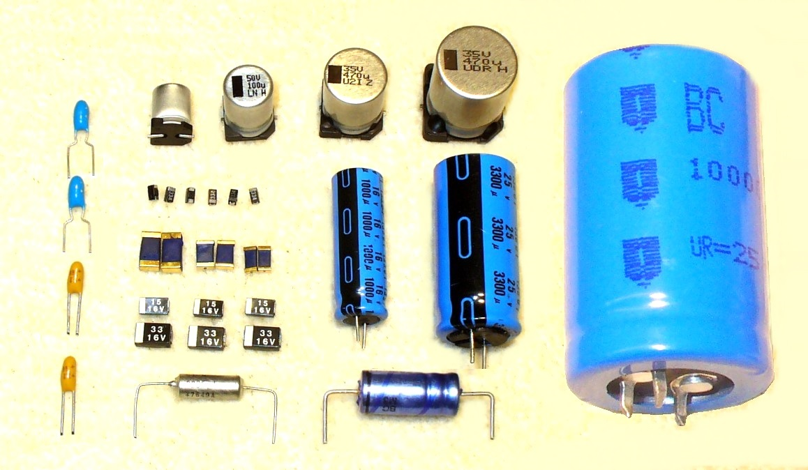

# Capacitor in Automobiles

<figure class="aligncenter">
    
    <figcaption>Electrolytic Capacitors</figcaption>
</figure>

A capacitor is a passive two-terminal electrical component that stores electrical energy in an electric field. The effect of a capacitor is known as capacitance.

## How Does a Capacitor Work?

A capacitor works by accumulating an electric charge on its plates when it is connected to a power source. When the power source is removed, the capacitor holds the charge until it is discharged. 

Capacitors are used in various ways in automobiles, as detailed below.

## Role of Capacitors in Automobiles

1. **Radio Noise Suppression**: Capacitors are used in the ignition system to prevent electrical noise that can interfere with the radio and other electronics in your car.

2. **Power Conditioning**: Capacitors are also used in the electrical system to smooth out power supply, reduce noise, and provide extra power when needed. 

3. **Engine Control Unit (ECU)**: Capacitors are used in the ECU to ensure steady voltage supply to the microprocessor. 

4. **Hybrid and Electric Vehicles**: Capacitors are crucial in electric and hybrid vehicles. They are used to store energy and provide power to the car's electric motor.

## Capacitor Failure in Cars

Capacitor failure in cars can lead to issues such as:

- Poor engine performance
- Radio interference
- Electronic component failures

It's essential to periodically check and replace capacitors, if necessary, to ensure the smooth operation of your vehicle.

## Conclusion

Capacitors play a vital role in the operation of modern vehicles. They ensure the smooth function of various electronic components and aid in noise suppression and power supply.

