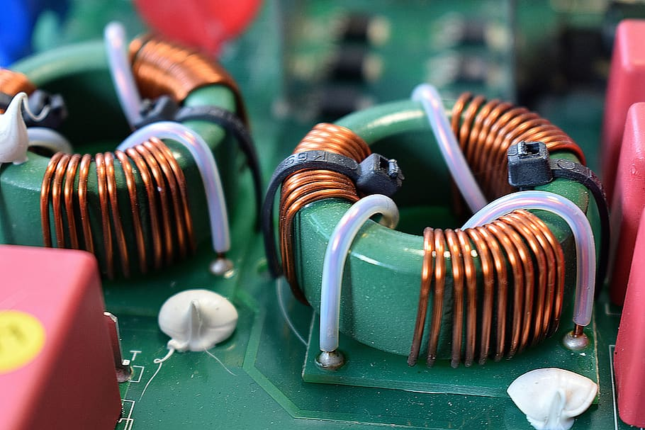

# Inductors

<figure class="aligncenter">
    
    <figcaption>Inductor</figcaption>
</figure>

An inductor is a passive two-terminal electrical component that stores energy in a magnetic field when electric current flows through it.

## How Does an Inductor Work?

Inductors work on the principle of inductance, which is the property of an electrical conductor by which a change in electric current through it induces an electromotive force (voltage) in the conductor itself (self-inductance) and in any nearby conductors (mutual inductance).

## Role of Inductors in Automobiles

1. **Ignition Coil**: The ignition coil, a type of inductor, is used to transform the vehicle's low voltage power to the high voltage needed to create an electric spark in the spark plugs to ignite the fuel.

2. **Filtering Noise**: Inductors, being a crucial component in a choke or filter, are used to block or filter out high-frequency noise in the electrical system of a vehicle.

3. **Regulating Power**: Inductors are also used in the voltage regulators that control the voltage level and switch power to the alternator when the battery is fully charged.

4. **Audio Systems**: In car audio systems, inductors are used as low-pass filters to allow low-frequency signals to reach the speakers while blocking higher frequency signals.

5. **Electric Vehicles**: In electric vehicles, inductors are used in the DC-to-DC converters and in the inverters that convert the battery's DC power to the AC power needed for the vehicle's electric motor.

## Inductor Failure in Cars

Inductor failure in cars can lead to issues such as:

- Poor engine performance
- Audio system malfunction
- Power regulation issues

## Testing an Inductor with a Multimeter

Please note that not all multimeters have the capability to measure inductance. Before proceeding, make sure you have an LCR meter or a multimeter with an inductance setting.

### Step 1: Safety Precautions

Ensure your safety by wearing rubber-soled shoes, protective gloves, and safety goggles.

### Step 2: Disconnect the Inductor

Turn off and disconnect the device from any power source. Remove the inductor from the circuit it's a part of.

### Step 3: Set Your Multimeter

Set your multimeter or LCR meter to measure inductance. This is often indicated by the symbol 'L' on the dial.

### Step 4: Connect the Multimeter

Connect the multimeter probes to the inductor terminals. The polarity does not matter when testing inductance.

### Step 5: Read the Multimeter

Read the display on the multimeter. The reading should be close to the value indicated on the inductor. If the reading is significantly lower or the meter shows an open circuit, the inductor may be damaged.

### Conclusion

Testing an inductor with a multimeter is a straightforward process, but always remember safety precautions. If your inductor is showing signs of failure, replace it promptly to prevent potential damage.

