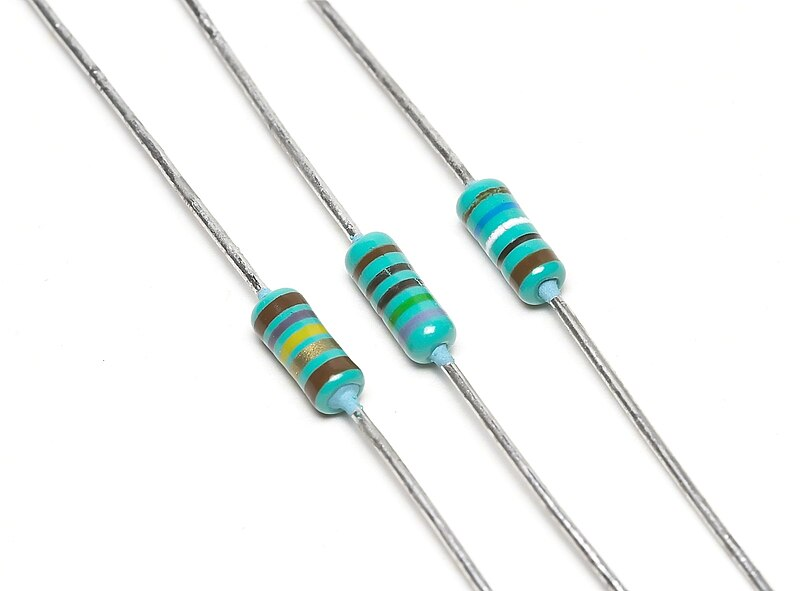
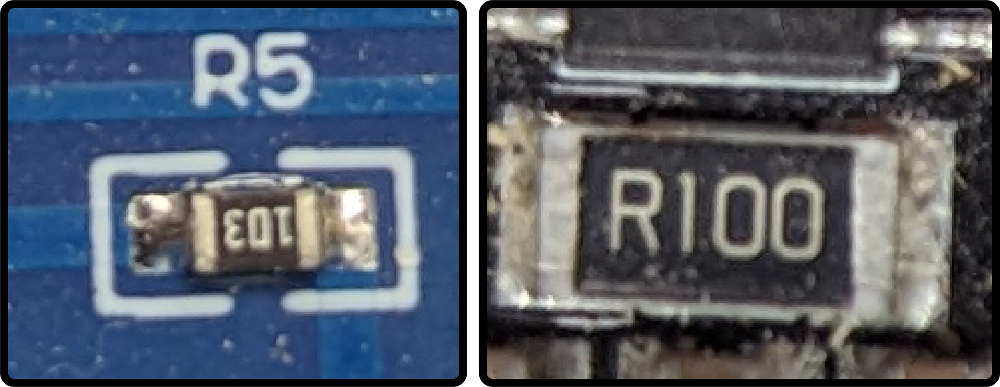
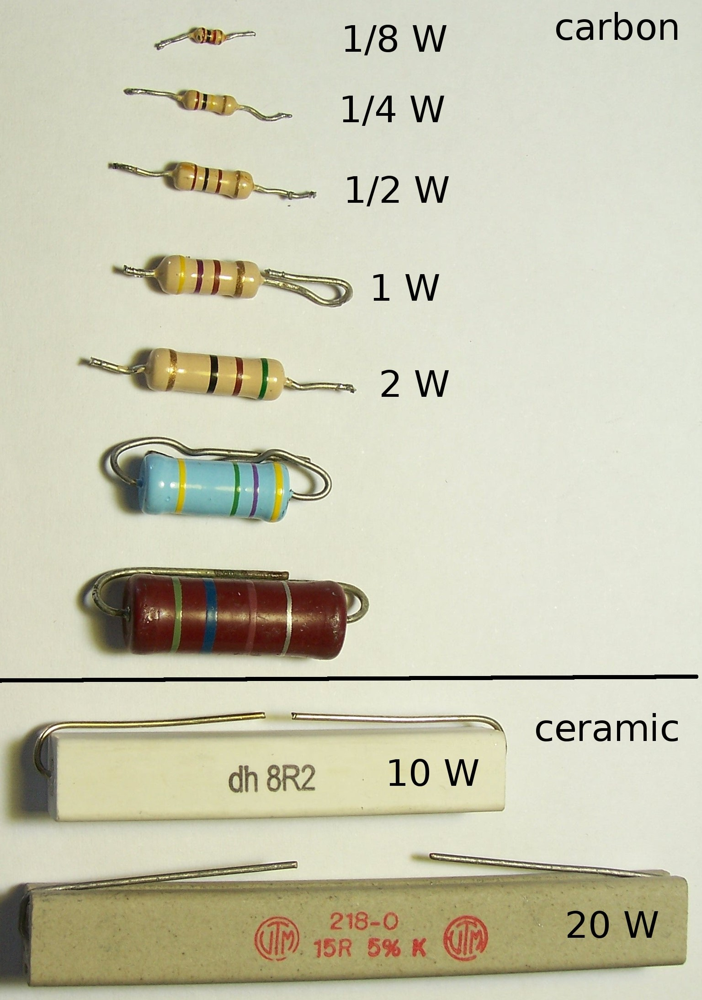

# Resistors

Resistors are passive two-terminal electrical components that implement electrical resistance as a circuit element. They reduce current flow and, at the same time, lower voltage levels within circuits.

<figure class="aligncenter">
    
    <figcaption>Resistors</figcaption>
</figure>

## How Does a Resistor Work?

A resistor works by impeding or restricting the flow of electrical current. Its resistance is measured in ohms, represented by the symbol "Ω."

## Fixed Resistors

Fixed resistors are resistors whose resistance values remain constant and cannot be changed or adjusted. They are the most commonly used type of resistor and come in various forms:

<figure class="aligncenter">
    
    <figcaption>Schematic Symbol for Fixed Resistor</figcaption>
</figure>

1. **Carbon Composition**: These are made of a carbon powder mixed with a binder and have been largely replaced by other types due to better stability and accuracy.

2. **Metal Film and Carbon Film**: These are thin-film resistors where a metal or carbon layer is deposited onto an insulating substrate. They offer better precision and stability than carbon composition resistors.

3. **Wirewound**: These consist of a metal wire wrapped around an insulating core. They're often used in high-power applications.

<figure class="aligncenter">
    
    <figcaption>Thin Film Resistors</figcaption>
</figure>

### Role of Fixed Resistors in Automobiles

- **Voltage Regulation**: They maintain a consistent voltage across critical components.
  
- **Signal Conditioning**: In sensor circuits, they help adjust and set signal levels.

## Variable Resistors

Variable resistors, often referred to as potentiometers or rheostats, allow for adjustable resistance. Their resistance can be changed by adjusting a knob or slider.

<figure class="aligncenter">
    
    <figcaption>Schematic Symbol for Variable Resistor</figcaption>
</figure>

1. **Potentiometers**: These have three terminals and provide variable voltage. They are frequently used in volume controls in audio systems.

2. **Rheostats**: These have two terminals and are designed to control current. They are used in applications where it's necessary to adjust the current, like in dimmer switches.

### Role of Variable Resistors in Automobiles

- **Sensors**: Many sensors in a car, such as the throttle position sensor, use potentiometers to relay information about a position or range back to the car's computer system.
  
- **Control Systems**: Variable resistors are often found in controls for audio or heating systems, allowing the user to adjust settings.

## Wattage Rating of Resistors

The wattage rating of a resistor indicates how much power it can safely dissipate without overheating or getting damaged. Power is the product of voltage and current (P = V x I). When current flows through a resistor, energy is dissipated as heat. The wattage rating ensures that the resistor can handle the heat produced without any adverse effects.

<figure class="aligncenter">
    
    <figcaption>Wattage of a Resistor</figcaption>
</figure>

### Importance of Wattage Rating

1. **Safety**: Using a resistor with a wattage rating that's too low for a given circuit can lead to overheating, potentially causing fires or damage to surrounding components.

2. **Performance**: A correctly rated resistor will operate efficiently and last longer. An underrated resistor might fail prematurely.

3. **Tolerance**: High-wattage resistors often have better tolerance to power surges or spikes in a circuit.

### Selecting the Right Wattage

When choosing a resistor for a particular application:

- Determine the maximum power the resistor will experience. This can be calculated using Ohm's Law and the Power Law.
  
- Choose a resistor with a wattage rating greater than the maximum power calculated. A common practice is to select a resistor with a wattage rating at least double the expected power dissipation for added safety.

### Role in Automobiles

- **Durability**: In automotive applications, resistors might experience power surges. Using resistors with the correct wattage rating ensures longevity.
  
- **Protection**: In systems like headlights, dashboard illumination, or entertainment units, the correct wattage ensures components aren't damaged due to excessive heat.

## Testing a Resistor with a Multimeter

### Step 1: Disconnect the Resistor

Before testing, ensure the resistor is disconnected from any circuit.

### Step 2: Set Your Multimeter

Set your multimeter to the resistance (ohms Ω) mode.

### Step 3: Connect the Multimeter

Place one lead of the multimeter on one end of the resistor and the other lead on the opposite end.

### Step 4: Read the Multimeter

Compare the reading on the multimeter to the value stated on the resistor. A color code on the resistor usually denotes its value. A resistor may be considered faulty if the discrepancy between the measured value and the stated value is more than 10%.

