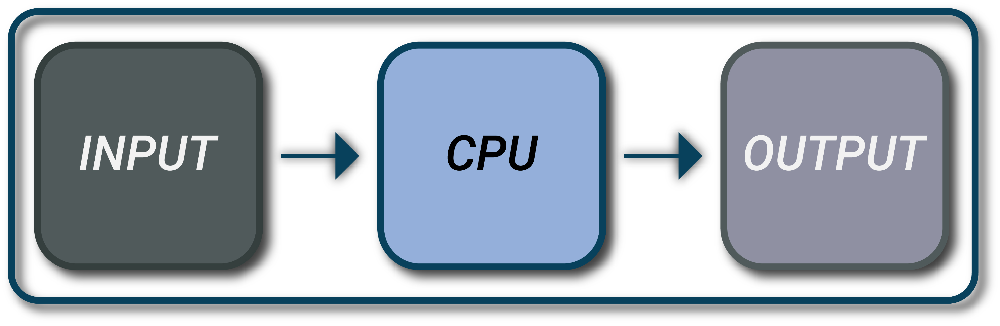

# Vehicle Electronics

Modern cars have transformed from purely mechanical devices into marvels of electronics and computing. Underneath the sleek exteriors, a multitude of sensors and computer systems work in unison to ensure optimal performance, safety, and efficiency. For those who service these vehicles, a detailed understanding of these systems is crucial. This article, accompanying our latest YouTube video, offers a technical overview of the inputs and outputs in car computer systems.

<figure class="aligncenter">
    
    <figcaption>Inputs CPU Output</figcaption>
</figure>

---

## Inputs: The Eyes and Ears of a Car's Computer System

The car's computer, often referred to as the Engine Control Unit (ECU) or Electronic Control Module (ECM), relies heavily on a network of sensors. These sensors provide real-time data for the ECU to make informed decisions.

1. **Switches**:
   - **Type**: Electro-mechanical devices.
   - **Function**: Used for various functions like starting the car, operating lights, or activating different modes. They work by opening or closing electrical circuits, sending signals to the ECU based on user input.

2. **Temperature Sensors**:
   - **Type**: Typically NTC (Negative Temperature Coefficient) thermistors.
   - **Function**: Measure engine and coolant temperatures to inform decisions on fuel injection and ignition timing.

3. **Speed Sensors**:
   - **Type**: Hall-effect or magnetic.
   - **Function**: Measure wheel speed, informing the Anti-lock Braking System (ABS) and other related systems.

4. **Oxygen Sensors (O2 Sensors)**:
   - **Type**: Often zirconium or titania-based.
   - **Function**: Placed in the exhaust system, these sensors measure oxygen content for closed-loop fuel control and monitor catalytic converter efficiency.

5. **Parking Sensors**:
   - **Type**: Ultrasonic.
   - **Function**: Emit and receive sound waves to detect nearby obstacles, helping drivers park safely.

---

## Central Processing Unit (CPU): The Brain Behind the Operation

The heart of any vehicle's electronic system is its central processor. Just as the human brain interprets signals from the eyes and ears to make informed decisions, the ECU or ECM in a vehicle processes data from various sensors and produces outputs that drive different components.

### The Engine Control Unit (ECU) or Electronic Control Module (ECM):

- **Nature**: Digital computer
- **Location**: Typically located in the engine compartment for easy connectivity with various engine components.
- **Main Functions**:
  - **Data Processing**: Gathers data from different sensors, processes it, and then determines the best course of action. This can range from adjusting the fuel-to-air ratio to optimizing the ignition timing.
  - **Diagnostics**: Monitors system performance and flags any irregularities or malfunctions. Advanced systems can suggest potential remedies or predict upcoming maintenance needs.
  - **Communication**: Interacts with other modules in the vehicle like the Transmission Control Module (TCM) or the Body Control Module (BCM) to ensure harmonious operation. This is often facilitated through the CAN bus system.
- **Features**:
  - **Adaptability**: Modern ECUs are adaptive, meaning they can "learn" from the behavior of the engine and make adjustments over time to improve performance and efficiency.
  - **Security**: With the rise of car hacking, modern ECUs come equipped with advanced security features to prevent unauthorized access and tampering.
  - **Upgradability**: As vehicle software becomes more sophisticated, ECUs are designed to receive software updates, much like computers or smartphones. This ensures the vehicle can leverage the latest advances in software algorithms, enhancing features or adding new functionalities.

### Importance:

With the emergence of electric vehicles and autonomous driving, the role of the ECU will only magnify. It won't solely focus on optimizing engine performance but will extend to tasks like battery health management, driving patterns analysis, navigation, and real-time decision-making in autonomous scenarios.

---
## Outputs: Translating Data into Action

Once data is collected and processed, the ECU generates commands which translate into tangible actions or indications for the driver.

1. **Dashboard Display**:
   - **Communication**: Via the Controller Area Network (CAN bus) system, a robust communication platform for vehicle electronics.
   - **Function**: Display critical data such as speed, fuel levels, and engine health metrics.

2. **Warning Lights**:
   - **Type**: Driven by solid-state relays or transistors.
   - **Function**: Illuminate to indicate specific fault conditions or maintenance needs.

3. **Speaker Alerts**:
   - **Generation**: Through pulse-width modulation signals or pre-recorded audio clips.
   - **Function**: Provide audio feedback or alerts to the driver, such as parking sensor beeps or safety warnings.

4. **Automatic Adjustments**:
   - **Mechanism**: Via servo motors and actuators.
   - **Function**: Execute adaptive changes like headlight positioning based on driving conditions.

5. **Engine Commands**:
   - **Transmission**: Using signaling methods like pulse-width modulation.
   - **Function**: Real-time adjustments to fuel injection, ignition timing, and throttle control based on sensor inputs.

---

## Conclusion

Cars today are a blend of mechanical and electronic systems. For technicians understanding the intricacies of these systems is more crucial than ever. As vehicle technology continues to advance, this fusion of mechanics and electronics will only become more integrated.

---

### Related Articles:

- [The Evolution Of Automotive Electronics Design]('https://resources.altium.com/p/the-evolution-of-automotive-electronics')
- [What is Automotive I/O?](https://www.aptiv.com/en/insights/article/what-is-automotive-i-o)

---


